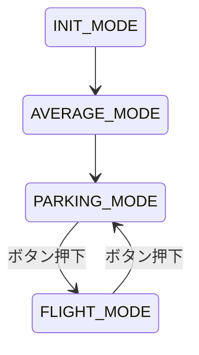

# M5StampFly コードフローチャート

## 概要

M5StampFly は、M5Stamp（ESP32 ベース）を使用した小型ドローン制御システムです。このドキュメントでは、M5StampFly のコードフローと主要なコンポーネントについて説明します。

## システム構成

M5StampFly は以下の主要なコンポーネントで構成されています：

- **センサー**: IMU（加速度計、ジャイロスコープ）、ToF センサー（距離測定）
- **モーター制御**: 4 つのモーターを制御する PWM 出力
- **LED**: ステータス表示用の LED
- **ボタン**: モード切り替え用のボタン
- **ブザー**: 音声フィードバック用
- **テレメトリー**: データ送信用のシリアル通信

## 動作モード

M5StampFly は以下の 4 つの動作モードを持っています：

1. **初期化モード (INIT_MODE)**: システムの初期化を行います
2. **平均化モード (AVERAGE_MODE)**: センサーのオフセット値を計算します
3. **飛行モード (FLIGHT_MODE)**: ドローンの飛行制御を行います
4. **着陸モード (PARKING_MODE)**: モーターを停止し、着陸状態を維持します

## メインフローチャート

```mermaid
graph TD
    A[電源投入] --> B[setup()実行<br>init_copter()]
    B --> C[タイマー割込設定<br>400Hz]
    C --> D[loop()関数実行<br>loop_400Hz()]
    D --> E[update_loop400Hz()<br>センサー値読み取り]
    E --> F[モード判定]
    F --> G[初期化モード]
    F --> H[平均化モード]
    F --> I[飛行モード]
    F --> J[着陸モード]
    G --> K[モーター停止]
    H --> L[ジャイロオフセット計算]
    I --> M[モーター制御]
    J --> N[モーター停止]
    K --> O[モード切替]
    L --> O
    M --> O
    N --> O
    O --> P[テレメトリーデータ送信]
```

## 初期化フロー (init_copter)

```mermaid
graph TD
    A[init_copter()] --> B[モード初期化\nINIT_MODE]
    B --> C[LED初期化]
    C --> D[シリアル通信初期化]
    D --> E[モーター初期化]
    E --> F[センサー初期化]
    F --> G[RC初期化]
    G --> H[ボタン初期化]
    H --> I[ブザー初期化]
    I --> J[タイマー割込設定\n400Hz]
```

## センサー読み取りフロー (sensor_read)

```mermaid
graph TD
    A[sensor_read()] --> B[IMUデータ読み取り\n加速度、角速度]
    B --> C[姿勢計算\nMadgwickフィルタ]
    C --> D[ToFセンサー読み取り\n高度情報]
    D --> E[バッテリー電圧\n読み取り]
```

## モード遷移図



## 主要なデータ構造

### StampFly 構造体

```c
typedef struct{
    sensor_value_t sensor;  // センサー値
    flag_t flag;            // 状態フラグ
    counter_t counter;      // カウンター
    pidstruct_t pid;        // PID制御パラメータ
    times_t times;          // 時間管理
}stampfly_t;
```

### センサー値構造体

```c
typedef struct{
    float accx;             // X軸加速度
    float accy;             // Y軸加速度
    float accz;             // Z軸加速度
    float roll_rate;        // ロール角速度
    float pitch_rate;       // ピッチ角速度
    float yaw_rate;         // ヨー角速度
    float roll_angel;       // ロール角
    float pitch_angle;      // ピッチ角
    float yaw_angle;        // ヨー角
    float voltage;          // バッテリー電圧
    uint16_t bottom_tof_range; // 下向きToFセンサー距離
}sensor_value_t;
```

## モーター制御

M5StampFly は 4 つのモーターを制御します：

- 前左 (FL): PIN_FRONT_LEFT (5)
- 前右 (FR): PIN_FRONT_RIGHT (42)
- 後左 (RL): PIN_REAR_LEFT (10)
- 後右 (RR): PIN_REAR_RIGHT (41)

モーターは PWM 信号で制御され、周波数は 150kHz、分解能は 8 ビットです。

## まとめ

M5StampFly は、初期化、センサーオフセット計算、飛行、着陸の 4 つのモードを持つドローン制御システムです。400Hz のタイマー割り込みによってメインループが実行され、センサーの読み取り、モーター制御、テレメトリーデータの送信などが行われます。ボタン入力によって飛行モードと着陸モードを切り替えることができます。
